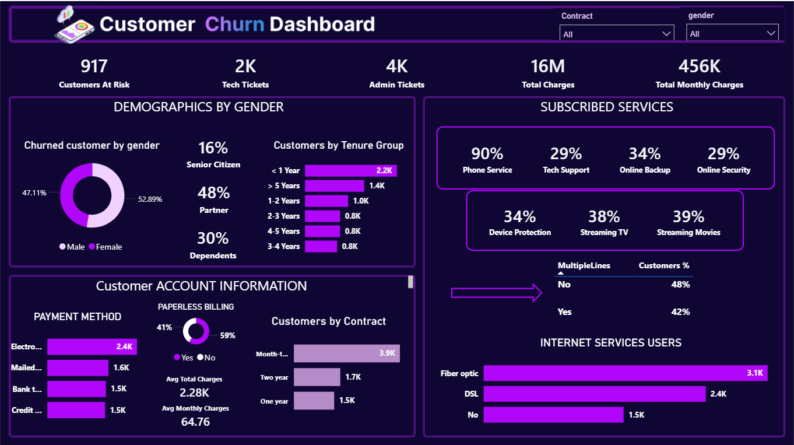

# Customer Churn Dashboard

Interactive Customer Churn Dashboard 📊 | Power BI

## 📌 Project Overview

This dashboard analyzes customer churn behavior to identify the factors that influence customer retention. It provides business insights through interactive visualizations and KPIs.

## 🎯 Objectives

- Analyze customer churn.
- Identify high-risk customer segments.
- Explore customer demographics.
- Analyze subscribed services and contracts.
- Build an interactive Power BI dashboard.

## 📊 Dashboard Features

- Customers at Risk
- Total Charges
- Monthly Charges
- Customer Demographics
- Contract Analysis
- Payment Methods
- Internet Services
- Subscribed Services
- Interactive Filters

## 🛠 Tools Used

- Power BI
- Power Query
- DAX
- Data Modeling

## 📷 Data Model

